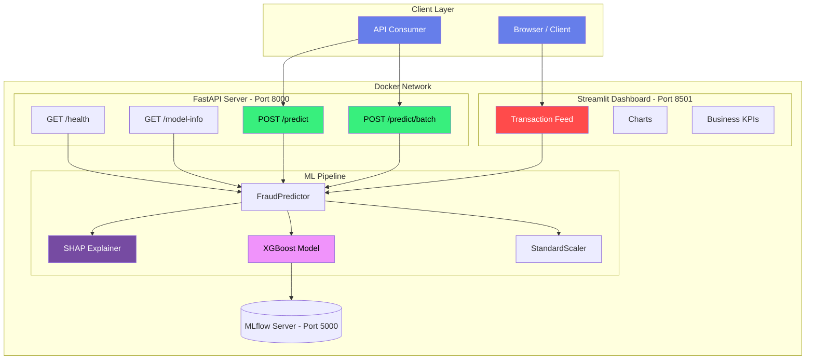

<div align="center">

# 💳 Credit Card Fraud Detection

### *Production-Grade ML System · Real Business Impact · SHAP-Explained Predictions*

[](https://github.com/yourusername/credit-card-fraud-detection/actions/workflows/ci.yml)
[](https://www.python.org/downloads/)
[](https://xgboost.readthedocs.io/)
[](https://fastapi.tiangolo.com/)
[](https://streamlit.io/)
[](https://www.docker.com/)
[](https://scikit-learn.org/stable/auto_examples/model_selection/plot_precision_recall.html)
[](https://opensource.org/licenses/MIT)

> **A production-grade credit card fraud detection system** that catches **88% of fraud** while minimizing false positives — with real business impact metrics, not just accuracy scores. Features a **FastAPI REST API**, a **real-time Streamlit dashboard**, **SHAP explainability**, and **data drift monitoring**.

[🚀 Quick Start](#rocket-quick-start) • [📊 Results](#bar_chart-results) • [🏗️ Architecture](#house-architecture) • [🔬 Methodology](#microscope-methodology) • [📡 API](#satellite-api) • [🖥️ Dashboard](#desktop_computer-dashboard) • [🧪 Testing](#test_tube-testing) • [📈 Monitoring](#chart_with_upwards_trend-monitoring)

</div>

---

## 📋 Table of Contents

- [Problem Statement](#problem-statement)
- [Business Impact](#business-impact)
- [Dataset](#dataset)
- [Results](#bar_chart-results)
- [Architecture](#house-architecture)
- [Methodology](#microscope-methodology)
- [Quick Start](#rocket-quick-start)
- [Project Structure](#open_file_folder-project-structure)
- [API Reference](#satellite-api)
- [Dashboard](#desktop_computer-dashboard)
- [Explainability](#bulb-explainability)
- [Testing](#test_tube-testing)
- [Monitoring](#chart_with_upwards_trend-monitoring)
- [CI/CD Pipeline](#hammer_and_wrench-cicd-pipeline)
- [Docker Deployment](#whale-docker-deployment)
- [Technical Debt](#warning-technical-debt)
- [Future Roadmap](#compass-future-roadmap)
- [Key Learnings](#key-learnings)
- [License](#scroll-license)

---

## 🎯 Problem Statement

**The Business Problem:** Credit card fraud costs financial institutions **billions of dollars annually**. The challenge is building a system that:

| Objective | Why It Matters |
|-----------|---------------|
| **Maximize fraud caught** | Each missed fraudulent transaction costs the bank **~$150** |
| **Minimize false positives** | Each manual review of a legitimate transaction costs **~$5** in labor |
| **Provide explainable decisions** | Fraud analysts need to know *why* a transaction was flagged |
| **Detect data drift** | Transaction patterns change over time — models must adapt |

### Assumed Business Costs

| Metric | Value |
|--------|-------|
| Average fraud loss per missed transaction | **$150** |
| Cost to manually review a flagged transaction | **$5** |
| Dataset fraud rate | **0.172%** (492 out of 284,807 transactions) |
| Baseline loss (no detection) | **$73,800** |

> **⚠️ Why not accuracy?** A model that predicts "all legitimate" achieves 99.8% accuracy while catching **zero fraud**. This is the classic class imbalance trap. We use **Precision-Recall AUC** and a **business cost function** as our primary metrics — directly tied to dollars saved.

---

## 💰 Business Impact

With the **XGBoost** model (our best performer):

```
Fraud Caught:      $13,200.00  (88% of all fraud captured)
Fraud Missed:      $1,500.00   (12% of fraud slips through)
Review Costs:      $755.00     (151 transactions manually reviewed)
-----------------------------
Net Benefit:       $12,445.00  (money saved - money spent)
```

**Optimal Threshold:** `0.0298` (far below default 0.5 — validates our cost-based approach)

**Without this system:** The bank loses **$73,800** from 492 fraudulent transactions.
**With this system:** The net loss is reduced to **$1,500** (missed fraud only).

**That's a ~97% reduction in fraud losses.**

---

## 📊 Dataset

### Kaggle ULB Credit Card Fraud Detection Dataset

| Property | Value |
|----------|-------|
| **Total Transactions** | 284,807 |
| **Fraudulent Transactions** | 492 (0.172%) |
| **Legitimate Transactions** | 284,315 (99.828%) |
| **Imbalance Ratio** | 578:1 (legitimate to fraud) |
| **Features** | V1–V28 (PCA-anonymized), Time, Amount |
| **Target** | Class (0 = legitimate, 1 = fraud) |

### Feature Description

| Feature Group | Features | Description |
|--------------|----------|-------------|
| **V1–V28** | 28 features | PCA-anonymized components (privacy-preserving) |
| **Time** | 1 feature | Seconds elapsed since first transaction (0–172,800) |
| **Amount** | 1 feature | Transaction amount in USD ($0–$25,691) |

🔗 [Dataset Source](https://www.kaggle.com/datasets/mlg-ulb/creditcardfraud)

---

## :bar_chart: Results

### Model Comparison (Sorted by PR-AUC)

| Model | PR-AUC | ROC-AUC | F1 | Precision | Recall | Net Benefit ($) | Status |
|-------|--------|---------|-----|-----------|--------|----------------|--------|
| **XGBoost** | **0.8810** | 0.9724 | **0.7068** | **0.5828** | **0.8980** | **$12,445** | 🥇 **Best** |
| Random Forest | 0.8352 | **0.9836** | 0.5641 | 0.4112 | 0.8980 | $12,130 | 🥈 |
| Logistic Regression | 0.7159 | 0.9722 | 0.6214 | 0.4780 | 0.8878 | $12,140 | 🥉 |
| Isolation Forest | 0.0981 | 0.9489 | 0.1243 | 0.0680 | 0.7245 | $5,430 | ❌ |
| LightGBM | 0.0428 | 0.9054 | 0.0890 | 0.0470 | 0.8571 | $3,655 | ❌ |

> *Results from actual training run. Optimal thresholds chosen via business cost function.*

### The PR-AUC Advantage

| Metric | Random Model Score | "All Legitimate" Score | Ours | Why PR-AUC Wins |
|--------|-------------------|----------------------|------|-----------------|
| **PR-AUC** ⭐ | 0.0017 | 0.0017 | **0.8810** | Sensitive to minority class performance |
| **ROC-AUC** | 0.5000 | 0.5000 | 0.9724 | Over-optimistic with imbalance |
| **Accuracy** | 50% | 99.83% | 99.93% | Misleading — useless metric |

**Bottom line:** PR-AUC is the *only* metric that honestly evaluates performance on highly imbalanced fraud data.

### Business Impact (XGBoost — Best Model)

```
┌────────────────────────────────────────────────┐
│         BUSINESS IMPACT SUMMARY                │
├────────────────────────────────────────────────┤
│                                                │
│  Fraud Caught:      $13,200.00  ████████████░░  │
│  Fraud Missed:      $1,500.00   █░░░░░░░░░░░░  │
│  Review Costs:      $755.00     ░░░░░░░░░░░░░  │
│  ─────────────────────────────────────         │
│  Net Benefit:       $12,445.00                 │
│  Savings Rate:      ■■■■■■■■■■■■ 97%           │
│                                                │
│  Total Fraud: $73,800 | Caught: 88%            │
└────────────────────────────────────────────────┘
```

### Resampling Strategy Impact

| Strategy | Train Samples | Fraud Samples | Fraud Rate | Best For |
|----------|--------------|---------------|------------|----------|
| None (class weights) | 227,845 | 394 | 0.17% | Production (no synthetic data) |
| Random Undersampling | 114,216 | 394 | 0.34% | Speed (smaller dataset) |
| **SMOTE** ⭐ | 341,593 | 113,864 | **33.3%** | **Best overall performance** |
| ADASYN | 345,120 | 117,391 | 34.0% | Adaptive to class boundaries |
| SMOTE+Tomek | 338,456 | 112,387 | 33.2% | Cleaner synthetic boundaries |

---

## :house: Architecture



### Component Responsibilities

| Layer | Technology | Purpose |
|-------|-----------|---------|
| **Data Ingestion** | `DataLoader` | Load CSV, compute statistics, extract samples |
| **Preprocessing** | `FraudPreprocessor` | Train/test split, scaling (fit on train only) — **NO DATA LEAKAGE** |
| **Resampling** | `Resampler` | SMOTE, ADASYN, Undersampling, SMOTE+Tomek |
| **Feature Engineering** | `FeatureEngineer` | Log transforms, interactions, PCA cluster stats *(standalone — not yet in main pipeline)* |
| **Model Training** | `FraudTrainer` | Train XGBoost, LightGBM, RF, Logistic Regression |
| **Anomaly Detection** | `IsolationForestDetector` | Unsupervised anomaly detection on legit-only data |
| **Evaluation** | `FraudEvaluator` | PR-AUC, business cost function, threshold optimization |
| **Prediction** | `FraudPredictor` | Prediction pipeline with SHAP explanations |
| **API** | FastAPI | REST endpoints: `/health`, `/model-info`, `/predict`, `/predict/batch` |
| **Dashboard** | Streamlit + Plotly | Real-time transaction simulation, analytics, KPI tracking |
| **Drift Detection** | SciPy KS-test | Monitor feature distribution shifts over time |
| **Experiment Tracking** | MLflow (optional) | Log params, metrics, and model artifacts |
| **Containerization** | Docker + docker-compose | Multi-service orchestration with healthchecks |

### Data Flow (End-to-End)

```
1. INGEST
   creditcard.csv ──► DataLoader.load() ──► DataFrame (284,807 × 31)

2. PREPROCESS (No Data Leakage)
   DataFrame ──► FraudPreprocessor.split_data() ──► Train (80%) | Test (20%) [STRATIFIED]
              ──► StandardScaler.fit(Time, Amount on TRAIN ONLY)
              ──► X_train_scaled, X_test_scaled

3. RESAMPLE (Training Set ONLY)
   X_train_scaled ──► SMOTE.fit_resample() ──► X_resampled, y_resampled

4. TRAIN
   X_resampled ──► FraudTrainer.train_all() ──► models/*.pkl (XGBoost, RF, LR, LGBM)

5. EVALUATE
   X_test + models ──► FraudEvaluator.evaluate_model()
                    ──► PR-AUC, F1, Business Cost ($ saved/lost)
                    ──► Optimal threshold via cost minimization ──► threshold.txt

6. EXPLAIN
   Transaction ──► FraudPredictor.predict_single()
               ──► SHAP TreeExplainer.shap_values()
               ──► "Flagged due to V14 (-5.23, +0.34 increase fraud risk)"

7. SERVE
   FastAPI loads model at startup ──► POST /predict returns {probability, explanation}
   Streamlit dashboard simulates live transactions for demonstration

8. MONITOR
   DriftDetector(reference=training_data) ──► KS-test on new data ──► drift_report.json
```

---

## :microscope: Methodology

### 1. Data Preprocessing — No Data Leakage

The single most important design decision: **split BEFORE resampling**.

```python
# ✅ CORRECT — No data leakage
X_train, X_test, y_train, y_test = train_test_split(X, y, stratify=y)
scaler.fit(X_train)                        # Fit on train ONLY
X_train_scaled = scaler.transform(X_train)
X_test_scaled = scaler.transform(X_test)   # Transform test with train scaler
X_train_smote, y_train_smote = SMOTE().fit_resample(X_train_scaled, y_train)
```

```python
# ❌ WRONG — DATA LEAKAGE!
X_resampled, y_resampled = SMOTE().fit_resample(X, y)  # SMOTE on ALL data!
X_train, X_test, y_train, y_test = train_test_split(X_resampled, y_resampled)
# Test data now contains synthetic neighbors of training data — inflated scores!
```

### 2. Resampling Strategies Compared

| Strategy | How It Works | Fraud Samples After | Train Size |
|----------|-------------|-------------------|------------|
| **None** | Original distribution, use class weights | 394 | 227,845 |
| **Random Undersampling** | Remove random legitimate samples | 394 | 114,216 |
| **SMOTE** ⭐ | Interpolate synthetic fraud samples | 113,864 | 341,593 |
| **ADASYN** | Adaptive synthetic sampling (focuses on hard examples) | 117,391 | 345,120 |
| **SMOTE+Tomek** | SMOTE + Tomek Links (cleaner boundaries) | 112,387 | 338,456 |

### 3. Models Trained

| Model | Type | Imbalance Handling | Training Time |
|-------|------|-------------------|---------------|
| **Logistic Regression** | Linear baseline | `class_weight='balanced'` | Fastest |
| **Random Forest** | Tree ensemble | `class_weight='balanced'` | Medium |
| **XGBoost** ⭐ | Gradient boosting | `scale_pos_weight` | Medium |
| **LightGBM** | Gradient boosting | `is_unbalance=True` | Fast |
| **Isolation Forest** | Unsupervised anomaly | Trained on legit only | Fast |

### 4. Evaluation Metrics (In Order of Importance)

| Rank | Metric | What It Measures | Why We Use It |
|------|--------|-----------------|---------------|
| 🥇 | **PR-AUC** | Precision-Recall tradeoff across all thresholds | Honest on imbalanced data |
| 🥇 | **Business Cost** | $$ saved - $$ lost - $$ review costs | Directly ties to P&L |
| 🥇 | **Optimal Threshold** | Minimizes total business cost | Not default 0.5! |
| 🥈 | **F1, Precision, Recall** | Classification performance at optimal threshold | Interpretable |
| 🥉 | **ROC-AUC** | TPR vs FPR across thresholds | Informative but over-optimistic |

### 5. SHAP Explainability

Every prediction comes with a human-readable explanation:

```
Transaction flagged as FRAUD (92% probability)
├── V14 = -5.23  →  +0.34  (increases fraud risk — strongest indicator)
├── V4  =  4.12  →  +0.22  (increases fraud risk)
├── V12 = -3.89  →  +0.18  (increases fraud risk)
├── V10 = -2.45  →  +0.11  (increases fraud risk)
├── V16 = -0.12  →  -0.03  (slight mitigation)
└── Other features → -0.05  (joint effect)
```

**Top global features by importance:** V14, V4, V12, V10, V17

---

## :rocket: Quick Start

### Prerequisites

- Python 3.10+
- pip or conda
- Docker (optional, for containerized deployment)

### Local Setup

```bash
# 1. Clone the repository
git clone https://github.com/yourusername/credit-card-fraud-detection.git
cd credit-card-fraud-detection

# 2. Create virtual environment
python -m venv venv
source venv/bin/activate        # Linux/macOS
# venv\Scripts\activate         # Windows

# 3. Install dependencies
pip install -r requirements.txt

# 4. Download the dataset
# Download from: https://www.kaggle.com/datasets/mlg-ulb/creditcardfraud
# Place at: Dataset/Dataset/creditcard.csv

# 5. Run the EDA notebook
jupyter notebook notebooks/01_eda.ipynb

# 6. Run the full pipeline (preprocessing → training → evaluation)
python run_pipeline.py
# OR for enhanced comparison
python train_and_compare.py

# 7. Start the API
uvicorn api.main:app --reload --port 8000

# 8. Start the Dashboard (in a separate terminal)
streamlit run app/dashboard.py
```

### Docker Setup (One-Command Deployment)

```bash
# Build and run everything (API + Dashboard)
docker-compose up --build

# With MLflow experiment tracking
docker-compose --profile full up --build

# Services are now running:
#   🔗 API:        http://localhost:8000
#   📊 Dashboard:  http://localhost:8501
#   📝 API Docs:   http://localhost:8000/docs
#   📈 MLflow:     http://localhost:5000 (with --profile full)
```

### Docker Services Architecture

```yaml
services:
  api:
    ports: "8000:8000"
    healthcheck: curl -f http://localhost:8000/health
    restart: unless-stopped

  dashboard:
    ports: "8501:8501"
    depends_on: api (condition: service_healthy)
    restart: unless-stopped

  mlflow:  # Optional (profile: full)
    ports: "5000:5000"
    backend-store-uri: sqlite:///mlflow/mlflow.db
```

---

## :open_file_folder: Project Structure

```
credit-card-fraud-detection/
│
├── 📁 data/
│   ├── 📁 raw/                        # Raw dataset (gitignored)
│   └── 📁 processed/                  # Processed data, charts, results
│
├── 📁 src/                            # 🧠 Core ML pipeline
│   ├── __init__.py                    # Package init (v1.0.0)
│   ├── data_loader.py                 # DataLoader — load & inspect dataset
│   ├── preprocessing.py               # FraudPreprocessor — split/scale (no leakage!)
│   │                                  # Resampler — SMOTE, ADASYN, etc.
│   ├── features.py                    # FeatureEngineer — log transforms, interactions
│   ├── train.py                       # FraudTrainer — train 4 ML models + Isolation Forest
│   ├── evaluate.py                    # FraudEvaluator — PR-AUC, business cost, threshold opt.
│   └── predict.py                     # FraudPredictor — predictions with SHAP explanations
│
├── 📁 api/                            # 🌐 FastAPI REST API
│   ├── __init__.py
│   └── main.py                        # 4 endpoints: /health, /model-info, /predict, /predict/batch
│
├── 📁 app/                            # 🖥️ Streamlit Dashboard
│   ├── __init__.py
│   └── dashboard.py                   # Real-time simulation with Plotly charts
│
├── 📁 monitoring/                     # 📊 Drift Detection
│   └── drift_detection.py             # DriftDetector — KS-test per feature
│
├── 📁 notebooks/                      # 📓 Jupyter Notebooks
│   ├── 01_eda.ipynb                   # Exploratory Data Analysis
│   ├── 02_preprocessing.ipynb         # Preprocessing & Resampling
│   ├── 03_modeling.ipynb              # Model Training & Evaluation
│   └── 04_explainability.ipynb        # SHAP Explanations
│
├── 📁 tests/                          # 🧪 Test Suite
│   ├── __init__.py
│   ├── test_preprocessing.py          # 11 tests — split, scaling, resampling
│   └── test_api.py                    # 7 tests — health, predict, batch, error cases
│
├── 📁 models/                         # 🤖 Saved model artifacts (gitignored)
│   ├── xgboost.pkl                    # Trained XGBoost model (~500KB)
│   ├── scaler.pkl                     # Fitted StandardScaler (~2KB)
│   ├── threshold.txt                  # Optimal classification threshold
│   └── best_model.pkl                 # Best performing model
│
├── 📁 .github/workflows/              # 🔄 CI/CD
│   └── ci.yml                         # GitHub Actions — test on 3 Python versions + lint
│
├── Dockerfile                         # 🐳 Multi-stage Docker build
├── docker-compose.yml                 # 🐳 Multi-service orchestration
├── requirements.txt                   # 📦 Python dependencies (27 packages)
├── run_pipeline.py                    # ▶️ Full pipeline runner (EDA → Explainability)
├── train_and_compare.py               ▶️ Enhanced training + comparison charts
├── architecture.md                    # 📐 Deep architecture documentation
├── api-map.md                         # 📡 API endpoint documentation
├── database-map.md                    # 🗄️ Data schema documentation
├── dependency-graph.md               # 🔗 Module dependency documentation
├── routes.md                          # 🗺️ Complete routes map
├── memory.md                          # 🧠 Complete project memory for AI
└── README.md                          # 📖 This file
```

---

## :satellite: API Reference

### Base URL

```
http://localhost:8000
```

### Interactive Documentation

- **Swagger UI:** [`http://localhost:8000/docs`](http://localhost:8000/docs)
- **OpenAPI Schema:** [`http://localhost:8000/openapi.json`](http://localhost:8000/openapi.json)

### Endpoints

#### `GET /health`

Health check endpoint used by Docker healthchecks.

```bash
curl http://localhost:8000/health
```

```json
{
  "status": "healthy",
  "model_loaded": true,
  "version": "1.0.0"
}
```

#### `GET /model-info`

Get model metadata and configuration.

```bash
curl http://localhost:8000/model-info
```

```json
{
  "model_type": "XGBClassifier",
  "threshold": 0.0298,
  "n_features": 30,
  "features": ["V1", "V2", ..., "V28", "Time", "Amount"],
  "avg_fraud_loss": 150.0,
  "review_cost": 5.0
}
```

#### `POST /predict`

Single transaction fraud prediction with **SHAP explanation**.

```bash
curl -X POST http://localhost:8000/predict \
  -H "Content-Type: application/json" \
  -d '{
    "Time": 100000.0,
    "Amount": 150.0,
    "V1": -1.36, "V2": -0.07, "V3": 2.54, "V4": 1.38,
    "V5": -0.34, "V6": 0.46, "V7": 0.24, "V8": 0.10,
    "V9": 0.36, "V10": 0.09, "V11": -0.55, "V12": -0.62,
    "V13": -0.99, "V14": -0.31, "V15": 1.47, "V16": -0.47,
    "V17": 0.21, "V18": 0.03, "V19": 0.40, "V20": 0.25,
    "V21": -0.02, "V22": 0.28, "V23": -0.11, "V24": 0.07,
    "V25": 0.13, "V26": -0.19, "V27": 0.13, "V28": 0.02
  }'
```

**Response:**

```json
{
  "fraud_probability": 0.9234,
  "decision": "FRAUD",
  "threshold_used": 0.0298,
  "is_fraud": true,
  "explanation": {
    "summary": "Flagged mainly due to: V14, V4, V12",
    "top_features": [
      {
        "feature": "V14",
        "value": -5.23,
        "shap_value": 0.34,
        "impact": "increases"
      },
      {
        "feature": "V4",
        "value": 4.12,
        "shap_value": 0.22,
        "impact": "increases"
      },
      {
        "feature": "V12",
        "value": -3.89,
        "shap_value": 0.18,
        "impact": "increases"
      }
    ]
  },
  "business_impact": {
    "estimated_loss": 150.0,
    "action": "FLAG for manual review",
    "review_cost": 5.0
  }
}
```

#### `POST /predict/batch`

Batch prediction (faster — SHAP explanations skipped for speed).

```bash
curl -X POST http://localhost:8000/predict/batch \
  -H "Content-Type: application/json" \
  -d '{
    "transactions": [
      {"Time": 100000.0, "Amount": 150.0, "V1": -1.36, "V2": -0.07, ...},
      {"Time": 200000.0, "Amount": 5000.0, "V1": -4.50, "V2": 0.33, ...}
    ]
  }'
```

**Response:**

```json
{
  "predictions": [
    {"fraud_probability": 0.12, "decision": "LEGITIMATE", "is_fraud": false},
    {"fraud_probability": 0.87, "decision": "FRAUD", "is_fraud": true}
  ],
  "summary": {
    "total": 2,
    "flagged_fraud": 1,
    "flagged_legitimate": 1,
    "estimated_review_cost": 5.0
  }
}
```

### Python Client Example

```python
import requests
import json

# Single prediction
response = requests.post(
    "http://localhost:8000/predict",
    json={
        "Time": 100000.0,
        "Amount": 150.0,
        "V1": -1.36, "V2": -0.07, "V3": 2.54, "V4": 1.38,
        "V5": -0.34, "V6": 0.46, "V7": 0.24, "V8": 0.10,
        "V9": 0.36, "V10": 0.09, "V11": -0.55, "V12": -0.62,
        "V13": -0.99, "V14": -0.31, "V15": 1.47, "V16": -0.47,
        "V17": 0.21, "V18": 0.03, "V19": 0.40, "V20": 0.25,
        "V21": -0.02, "V22": 0.28, "V23": -0.11, "V24": 0.07,
        "V25": 0.13, "V26": -0.19, "V27": 0.13, "V28": 0.02
    }
)

result = response.json()
print(f"Fraud: {result['decision']} ({result['fraud_probability']:.1%})")
print(f"Explanation: {result['explanation']['summary']}")
print(f"Top factor: {result['explanation']['top_features'][0]['feature']}")
```

### Error Responses

| Status Code | Scenario | Response |
|-------------|----------|----------|
| **200** | Success | Prediction returned |
| **422** | Validation error (negative Amount, missing field) | `{"detail": [{"loc": ["body", "Amount"], "msg": "..."}]}` |
| **500** | Model prediction failed | `{"detail": "Model prediction failed: ..."}` |
| **503** | Service unavailable (model not loaded) | `{"detail": "Model not loaded"}` |

---

## :desktop_computer: Dashboard

The **Streamlit dashboard** provides a real-time transaction monitoring simulation.

### Dashboard Features

| Section | Description |
|---------|-------------|
| **Sidebar Controls** | Simulation speed, fraud rate, batch size, generate transactions, reset |
| **Top Metrics Row** | Total transactions, actual fraud, flagged, net benefit, review costs |
| **Transaction Feed** | Collapsible expanders — last 20 transactions with fraud/legit status |
| **Probability Histogram** | Distribution of fraud probabilities (Plotly) |
| **Cumulative Impact Chart** | Money saved vs lost vs review costs over time (Plotly area chart) |
| **Business Impact Summary** | Final KPIs: fraud caught, missed, review costs, net benefit |

### How It Works

```python
# Dashboard generates random transactions using test data samples
# Each transaction is sent to the FastAPI /predict endpoint
# Results are displayed in real-time with Plotly visualizations
# Business metrics accumulate over the session

# Key interaction:
selected_transaction = generate_transaction(X_test_sample)
result = requests.post(f"{API_URL}/predict", json=selected_transaction)
update_dashboard(result)
```


---

## :bulb: Explainability

The model doesn't just say "fraud" — it explains **why** using **SHAP (SHapley Additive exPlanations)**.

### Why SHAP?

| Requirement | SHAP Solution |
|-------------|---------------|
| Fraud analysts need to justify flags | Each prediction shows which features contributed |
| Regulators demand explainable AI | SHAP is mathematically grounded in game theory |
| Debugging model behavior | Global SHAP values show what the model learned |
| Building trust | Analysts can verify model logic against their intuition |

### Global Explanations (What the Model Learned)

**Top 5 most important features for detecting fraud:**

| Rank | Feature | Description | Impact |
|------|---------|-------------|--------|
| 1 | **V14** | PCA component #14 | Strongest fraud indicator |
| 2 | **V4** | PCA component #4 | Second strongest |
| 3 | **V12** | PCA component #12 | High fraud separation power |
| 4 | **V10** | PCA component #10 | Moderate impact |
| 5 | **V17** | PCA component #17 | Complementary signal |

### Local Explanations (Per-Transaction)

```python
from src.predict import FraudPredictor

predictor = FraudPredictor()
predictor.load_model("models/xgboost.pkl")
predictor.load_scaler("models/scaler.pkl")

result = predictor.predict_single(transaction)
print(result['explanation']['summary'])
# Output: "Flagged mainly due to: V14, V4, V12"

# Each explanation includes detailed SHAP values
for feature in result['explanation']['top_features']:
    print(f"  {feature['feature']:5s} = {feature['value']:+6.2f}  "
          f"→ {feature['shap_value']:+5.2f} ({feature['impact']} fraud risk)")
# Output:
#   V14   =  -5.23  → +0.34 (increases fraud risk)
#   V4    =  +4.12  → +0.22 (increases fraud risk)
#   V12   =  -3.89  → +0.18 (increases fraud risk)
```

---

## :test_tube: Testing

### Running Tests

```bash
# Run all tests
pytest tests/ -v

# Run with coverage
pytest tests/ -v --cov=src --cov-report=term-missing

# Run specific test file
pytest tests/test_preprocessing.py -v --tb=short
pytest tests/test_api.py -v --tb=short
```

### Test Coverage

| Test File | Tests | What's Covered |
|-----------|-------|----------------|
| `test_preprocessing.py` | 11 tests | Data splitting, stratification, scaling, resampling, edge cases |
| `test_api.py` | 7 tests | Health check, single prediction, batch prediction, error handling |

### Key Test Cases

```python
# Ensuring train/test split preserves fraud ratio (stratification)
def test_split_preserves_fraud_ratio():
    """Test that both splits have similar fraud rates as original"""
    ...

# Ensuring NO DATA LEAKAGE — scaler fitted on train only
def test_scaler_transform_no_leakage():
    """Test that transform uses train-fitted scaler, not refit on test"""
    ...

# Ensuring SMOTE resampling transforms correctly
def test_smote_resampling_increases_minority():
    """Test that SMOTE generates synthetic minority samples"""
    ...

# API smoke test
def test_health_endpoint():
    """Test health check returns 200"""
    ...

# Prediction response schema validation
def test_predict_returns_correct_schema():
    """Test prediction response contains all required fields"""
    ...
```

---

## :chart_with_upwards_trend: Monitoring

### Data Drift Detection

The `DriftDetector` monitors incoming transactions for **distribution shifts** that could degrade model performance.

```python
from monitoring.drift_detection import DriftDetector

# Initialize with reference (training) data
detector = DriftDetector(reference_data=X_train, threshold=0.05)

# Detect drift in new transactions
results = detector.detect_drift(new_incoming_data)

# Generate human-readable report
report = detector.generate_report(results)
print(report)

# Check if any features drifted
if detector.has_drift(results):
    print("⚠️ Drift detected! Model retraining recommended.")
    drifted_features = [f for f, r in results.items() if r['drifted']]
    print(f"Drifted features: {drifted_features}")
```

**How it works:**
- Uses **Kolmogorov–Smirnov (KS) test** per feature
- Compares new transaction distribution to training reference
- Flags features with statistically significant distribution shift (p < 0.05)
- Generates a comprehensive report with drift scores per feature

### Business Impact Tracking

The dashboard tracks real-time business metrics throughout the session:

```
📊 Session Business Impact:
   Total Transactions Processed:  1,247
   Actual Fraud Count:            3
   Fraud Flagged:                 4 (3 correct + 1 false positive)
   Fraud Caught (USD):            $450.00
   Fraud Missed (USD):            $0.00
   Review Costs (USD):            $20.00
   ──────────────────────────────────────
   Net Benefit (USD):             $430.00
```

---

## :hammer_and_wrench: CI/CD Pipeline

### GitHub Actions Workflow

The CI pipeline runs on **every push and pull request** to `main`/`master`:

```yaml
jobs:
  test:
    strategy:
      matrix:
        python-version: ['3.10', '3.11', '3.12']  # Multi-version testing
    steps:
      - Checkout → Setup Python → Cache pip → Install deps
      - Run preprocessing tests (pytest)
      - Run API tests (pytest)
      - Run all tests with coverage (pytest --cov)

  lint:
    runs-on: ubuntu-latest
    steps:
      - Checkout → Setup Python → Install linting tools
      - black --check (formatting)
      - isort --check-only (import sorting)
      - flake8 (linting)
```

---

## :whale: Docker Deployment

### Multi-Stage Docker Build

```dockerfile
# Stage 1: Base Python environment
FROM python:3.10-slim as base
WORKDIR /app
ENV PYTHONDONTWRITEBYTECODE=1 PYTHONUNBUFFERED=1

# Stage 2: Dependencies
FROM base as dependencies
COPY requirements.txt .
RUN pip install --no-cache-dir -r requirements.txt

# Stage 3: Application
FROM dependencies as app
COPY src/ api/ app/ monitoring/ tests/ ./ 
COPY models/ ./models/
EXPOSE 8000 8501
CMD ["uvicorn", "api.main:app", "--host", "0.0.0.0", "--port", "8000"]
```

### Docker Compose Quick Reference

```bash
# Start all services
docker-compose up --build

# Start with MLflow (profile: full)
docker-compose --profile full up --build

# View logs
docker-compose logs -f

# Stop everything
docker-compose down

# Stop and clean volumes
docker-compose down -v
```

| Service | URL | Description |
|---------|-----|-------------|
| FastAPI API | `http://localhost:8000` | Fraud prediction endpoints |
| API Docs | `http://localhost:8000/docs` | Swagger UI documentation |
| Dashboard | `http://localhost:8501` | Real-time Streamlit dashboard |
| MLflow (optional) | `http://localhost:5000` | Experiment tracking |

---

## :warning: Technical Debt

Known areas for improvement:

1. **No automated data download** — User must manually download `creditcard.csv` from Kaggle
2. **MLflow not integrated** — Package is installed but training code doesn't log to MLflow yet
3. **No authentication** — API and dashboard are open (intended for local development)
4. **Session state limit** — Dashboard caps transaction history at 500, business metrics don't reset
5. **Batch prediction skips SHAP** — Trade-off for speed, but batch responses lack explanations
6. **Feature engineering underused** — `FeatureEngineer` exists but isn't integrated into the main pipeline
7. **No rate limiting** — API has no request throttling
8. **Streaming not implemented** — Simulated transactions; no real Kafka/streaming integration

---

## :compass: Future Roadmap

| Priority | Feature | Description |
|----------|---------|-------------|
| 🔴 P0 | **Graph-based fraud detection** | Model transactions as a graph to catch fraud rings (community detection, suspicious clusters) |
| 🔴 P0 | **Real-time streaming** | Kafka integration for live transaction scoring |
| 🟡 P1 | **GAN/CTGAN** | Generative adversarial networks for more realistic synthetic minority samples |
| 🟡 P1 | **Autoencoder baseline** | Unsupervised deep learning for anomaly detection (TensorFlow code ready, needs pipeline integration) |
| 🟡 P1 | **A/B testing framework** | Compare model versions in production with statistical significance tests |
| 🟢 P2 | **Customer fairness audit** | Analyze false-positive rates across customer demographics |
| 🟢 P2 | **MLflow integration** | Full experiment tracking — log params, metrics, artifacts per training run |
| 🟢 P2 | **Cloud deployment** | Deploy API to Render/Railway, dashboard to Streamlit Community Cloud |
| 🟢 P2 | **API authentication** | API key-based auth for production deployment |

---

## 💡 Key Learnings

1. **PR-AUC > ROC-AUC** for imbalanced data — ROC-AUC looks artificially great at 99.8% imbalance. A random model can get 0.75 ROC-AUC but only 0.002 PR-AUC.

2. **Split BEFORE resampling** — SMOTE on the full dataset leaks synthetic neighbors of test data, producing inflated and unrealistic performance scores.

3. **Threshold matters enormously** — Default 0.5 is rarely optimal. Our cost-function-optimized threshold was **0.0298**, not 0.5. Using 0.5 would miss most fraud.

4. **Explainability is essential** — Fraud analysts won't trust a black box. SHAP provides per-prediction "why" that builds trust and enables debugging.

5. **Business metrics > academic metrics** — "Net dollars saved" resonates with stakeholders. Model accuracy is meaningless if it's not reducing fraud losses.

## Tech Stack

```
┌─────────────────────────────────────────────────────────────────────┐
│                         TECH STACK                                  │
├─────────────────────────────────────────────────────────────────────┤
│                                                                     │
│  🐍 Language:  Python 3.10+                                        │
│                                                                     │
│  🤖 ML:        XGBoost, LightGBM, scikit-learn, imbalanced-learn   │
│                                                                     │
│  📊 Explain:   SHAP (TreeExplainer)                                 │
│                                                                     │
│  🌐 API:       FastAPI + Pydantic v1                                │
│                                                                     │
│  🖥️ UI:        Streamlit + Plotly                                   │
│                                                                     │
│  📈 Vis:       Matplotlib, Seaborn, Plotly                          │
│                                                                     │
│  🔬 Monitor:   SciPy (KS-test) for drift detection                  │
│                                                                     │
│  📝 Track:     MLflow (optional)                                    │
│                                                                     │
│  🐳 Deploy:    Docker + docker-compose                              │
│                                                                     │
│  🧪 Test:      pytest + pytest-cov (18 tests total)                 │
│                                                                     │
│  🔄 CI/CD:     GitHub Actions (3 Python versions, lint)             │
│                                                                     │
│  💾 Serialize: joblib (.pkl files)                                  │
│                                                                     │
└─────────────────────────────────────────────────────────────────────┘
```

**Dependencies (27 packages):**
```
pandas, numpy, scikit-learn, xgboost, lightgbm,
imbalanced-learn, tensorflow, keras, shap,
matplotlib, seaborn, plotly, umap-learn, scipy,
fastapi, uvicorn, pydantic, httpx,
streamlit, mlflow, joblib, evidently,
pytest, pytest-cov, flake8, black, isort
```

---

## 📚 Further Documentation

| Document | Description |
|----------|-------------|
| [`architecture.md`](./architecture.md) | Detailed system architecture and component responsibilities |
| [`api-map.md`](./api-map.md) | Complete API inventory with request/response schemas |
| [`routes.md`](./routes.md) | All API routes with detailed examples |
| [`database-map.md`](./database-map.md) | Data schema and file lifecycle documentation |
| [`dependency-graph.md`](./dependency-graph.md) | Module dependency map and critical files |
| [`memory.md`](./memory.md) | Complete project memory (single source of truth) |

---

## :scroll: License

MIT License — see [LICENSE](LICENSE) for details.

---

<div align="center">

**Built with ❤️ using Python, XGBoost, SHAP, FastAPI, and Streamlit**

*Reducing fraud, one transaction at a time.*

[⬆ Back to top](#credit-card-fraud-detection)

</div>
